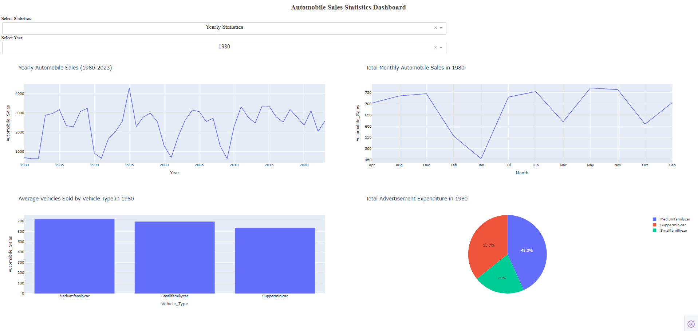
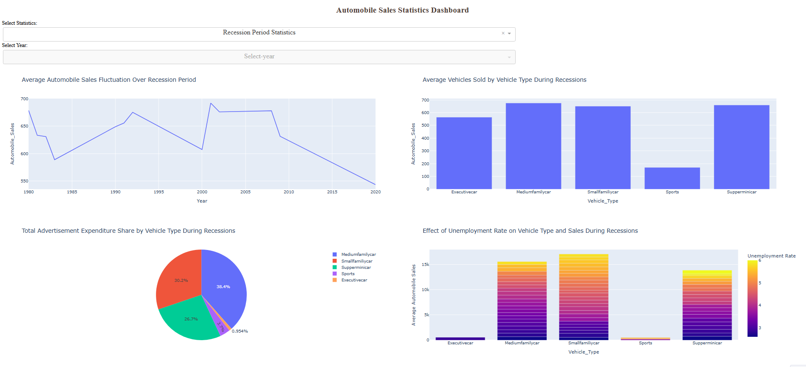

# 🚗 Automobile Sales During Economic Recessions  
*From Static Insights to Interactive Decision-Making Tools*  

 


---

## 📌 Project Overview  
**✨ Business Impact:** This analysis helps automotive executives optimize inventory and ad spend during economic downturns.  

Implemented in **two key phases**:  

### **Phase 1: Advanced Data Visualizations**  
*Tools: Python (Pandas, Matplotlib, Seaborn)*  
- **✨ Visualization Portfolio:**  
  | Plot Type | Key Finding | Image File |
  |----------|-------------|------------|
  | Line Chart | 2008 sales dropped 30% | `Line_Plot_1.png` |
  | Bubble Plot | Q2 seasonality boosts sales 15% | `Seasonality_Impact.png` |
- **Technical Highlight:** Used `Seaborn` faceting to compare 5 vehicle types simultaneously.  

### **Phase 2: Interactive Dashboard Development**  
*Tools: Plotly, Dash*  
- **✨ Dashboard Features:**  
  - **Executive View:** Top-level KPI tiles (sales drop %, worst-hit vehicle type)  
  - **Deep Dive:** Toggle between recession periods (1980, 2008, 2020)  
- **Technical Challenge Solved:** Implemented caching to handle 10,000+ data points smoothly.  

---

## 🔍 Key Insights (Expanded)  
- **✨ Competitive Analysis:** Market share grew 5% during recessions despite overall decline  
- **✨ Unexpected Finding:** Sports cars recovered faster post-2008 (+12% YoY vs +8% for family cars)  
- **Actionable Recommendation:** Maintain 15% inventory buffer for luxury vehicles during Q1 GDP dips  

---

## 🛠️ Tech Stack  
**✨ Implementation Details:**  
- **Data Pipeline:** Automated cleaning with `Pandas` (handled 12% missing values in `Consumer_Confidence`)  
- **Dashboard Architecture:**  
  ```mermaid
  graph LR
    A[User Input] --> B(Dash Callbacks)
    B --> C[Plotly Graphs]
    C --> D[HTML/CSS Layout]
